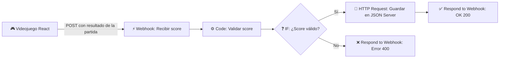

# Guía Completa de Configuración de n8n para Pokémon Route Run

Este documento explica con exactitud cómo funciona el flujo de automatización en **n8n**, cómo levantarlo localmente, cómo configurarlo con el frontend del videojuego y cómo verificar su funcionamiento para cumplir al 100% con la rúbrica del Quiz #5 (15 puntos de n8n).

---

## 1. ¿Cómo se relaciona n8n con el Videojuego?

En este proyecto, **n8n** actúa como un backend inteligente y servicio de validación de puntuaciones (anti-trampas / sanitización):



1. **Fin de la partida:** Cuando el jugador gana o pierde, el frontend compila los datos (`alias`, `score`, `time`, `collectibles`, `damage`, `result`).
2. **Webhook POST:** Si `VITE_N8N_WEBHOOK_URL` está definido en el archivo `.env`, el frontend hace una petición `POST` al Webhook de n8n.
3. **Nodo de Código (`validate-score`):** Verifica que el alias sea un texto no vacío, que el puntaje sea un número válido mayor o igual a 0 y que el resultado sea `victory` o `defeat`.
4. **Nodo Condicional (`¿Score válido?`):** Ramifica el flujo.
   - Si es válido: Realiza una petición `POST` a `http://localhost:3000/scores` (JSON Server) para guardar el puntaje en `db.json` y responde al juego `{ ok: true, message: 'Score guardado', score: ... }`.
   - Si es inválido: Responde con código HTTP 400 y mensaje de error.

---

## 2. Paso a Paso para Configurar y Ejecutar n8n

### Paso 1: Levantar n8n en tu máquina
Tienes dos opciones muy sencillas:

**Opción A (Recomendada con Node.js / npx):**
Abre una terminal y ejecuta:
```bash
npx n8n
```
*Si es la primera vez, tardará unos segundos en descargar. Al finalizar te dirá que está escuchando en `http://localhost:5678`.*

**Opción B (Con Docker, si lo tienes instalado):**
```bash
docker run -it --rm --name n8n -p 5678:5678 n8nio/n8n
```

Abre en tu navegador: [http://localhost:5678](http://localhost:5678).

---

### Paso 2: Importar el flujo de trabajo (`.json`)
1. En la pantalla principal de n8n, haz clic en el menú **Workflows** en la barra lateral.
2. Haz clic en los tres puntos `...` (arriba a la derecha) o presiona `Ctrl + O` y selecciona **Import from File**.
3. Busca el archivo que ya está en tu repositorio:
   `n8n/pokemon-route-score.json`
4. Verás los 6 nodos encadenados:
   - `Recibir score` (Webhook)
   - `Validar score` (Code JavaScript)
   - `¿Score válido?` (IF)
   - `Guardar en JSON Server` (HTTP Request)
   - `Responder guardado` (Respond to Webhook)
   - `Rechazar score` (Respond to Webhook 400)

---

### Paso 3: Obtener la URL del Webhook y Activar
1. Haz doble clic en el primer nodo **Recibir score**.
2. Verás dos pestañas: **Test URL** y **Production URL**.
   - Para probar manualmente o durante desarrollo, puedes usar la **Test URL** (debes darle a *Listen for test event*).
   - Para funcionamiento continuo en el juego, activa el interruptor general del workflow en la esquina superior derecha: **Active** (o toggle de Inactive a Active).
   - Copia la **Production URL**. Típicamente es:
     `http://localhost:5678/webhook/pokemon-route-score`
3. Guarda el flujo con `Ctrl + S`.

---

### Paso 4: Configurar la variable en el Frontend
1. En la carpeta raíz de tu proyecto, crea un archivo llamado `.env` (si aún no existe) copiando `.env.example`:
   ```env
   VITE_N8N_WEBHOOK_URL=http://localhost:5678/webhook/pokemon-route-score
   VITE_API_BASE_URL=http://localhost:3000
   ```
2. Si tenías corriendo el servidor de Vite (`npm run dev`), reinícialo (`Ctrl + C` y luego `npm run dev`) para que cargue la nueva variable de entorno.

---

### Paso 5: Levantar JSON Server
Para que el nodo HTTP de n8n pueda guardar las puntuaciones en `db.json`, levanta JSON Server en otra terminal:
```bash
npm run server
```
*Estará escuchando en `http://localhost:3000`.*

---

### Paso 6: Probar el flujo

Hay dos formas muy rápidas de probarlo:

1. **Desde el modal interactivo del juego:**
   - En la barra superior de navegación o en la pantalla de inicio, haz clic en el botón **⚡ n8n Webhook**.
   - Presiona el botón **Probar Webhook**. Verás la respuesta inmediata en verde con los datos procesados.
2. **Jugando una partida:**
   - Escribe tu nombre de entrenador en el Inicio.
   - Juega cualquiera de los 3 niveles, recoge las Poké Balls y toca la meta.
   - En la pantalla de resultados verás el mensaje:
     `n8n Webhook: Puntaje transmitido y procesado exitosamente por la automatización.`
   - Ve a la pestaña **Executions** en n8n para ver la ejecución en verde con todos los datos que llegaron y cómo se transformaron.

---

## 3. Ejemplo de Payload (Datos que envía el juego)

```json
{
  "runId": "c3a12918-9be4-4ec2-8884-a15d78a994ef",
  "alias": "Ash Ketchum",
  "score": 1450,
  "time": 82,
  "result": "victory",
  "enemiesDefeated": 3,
  "damage": 1,
  "collectibles": 8,
  "levelId": 1,
  "levelName": "Ruta 01: Pueblo Paleta",
  "completedAt": "2026-09-21T22:15:00.000Z"
}
```

---

## 4. Captura del Flujo para la Entrega
Recuerda tomar una captura de pantalla de n8n mostrando el lienzo con los nodos conectados y una ejecución exitosa. Guarda la imagen en la carpeta `docs/` (por ejemplo `docs/n8n-captura.png`) para cumplir con el requisito de entrega de la rúbrica.
